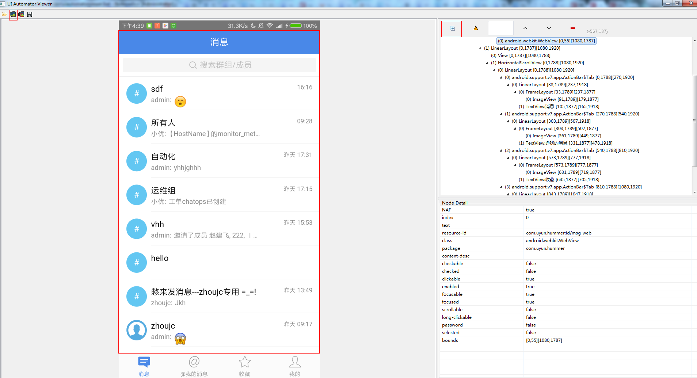
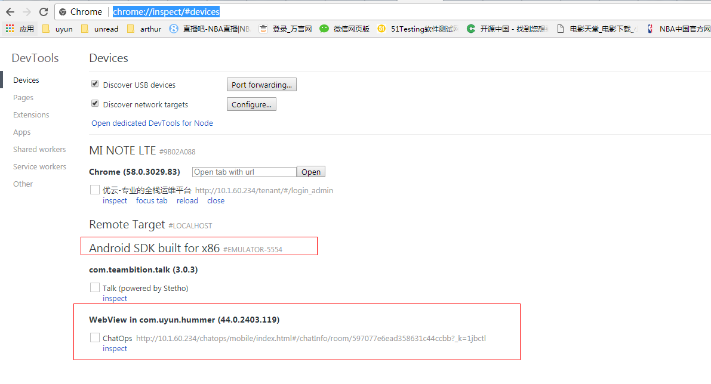
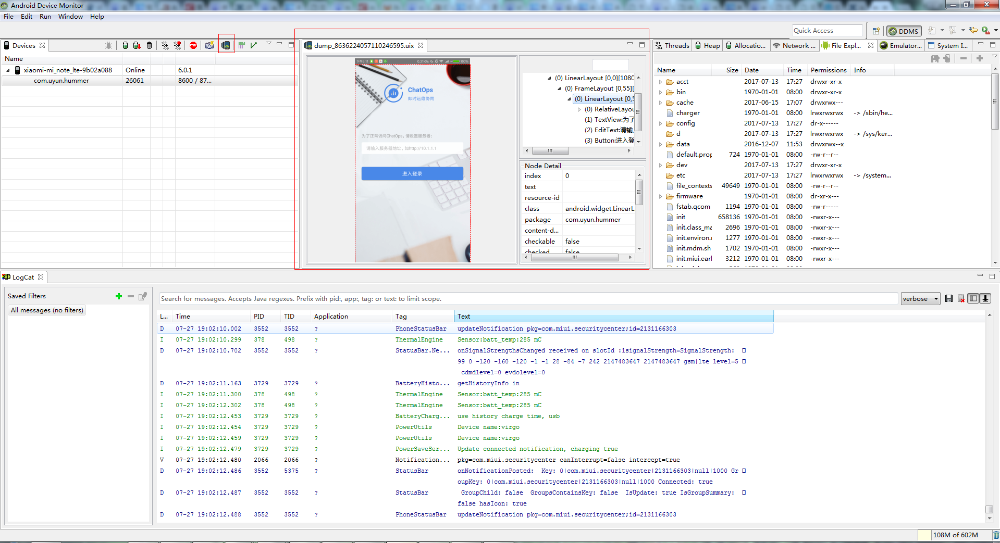

```
安装：
mac安装之前执行brew install carthage
从http://appium.io/downloads.html 下载对应平台的安装包

客户端安装：
pip install Appium-Python-Client
mac:
sudo pip install Appium-Python-Client --user

npm install -g appium-doctor

find_element_by_accessibility_id
使用 "Accessibility ID" 来定位元素。对于 ios 而言就是 accessibility identifier。
对于 android 就是 content-description

这个属性，主要是为了一些有残障的人士准备的，方便他们使用程序，所以这个警告前面会有一个[Accessbility]。

举个例子，比如你有个 ImageView 放一张图片，这个图片可能包含很多物体和颜色，一些色弱或者色盲的人，他们可能会分不清这个图到底画的什么东西，所以这个时候 contentDescription 就会起作用。比如可能 Android 的一些程序可以用声音告诉使用者这个图片画的是什么，他们读的就是你 contentDescription 的内容。

这其实和 iOS 的 accessibility identifier 是一样的。


wm = self.driver.get_window_size()

self.driver.swipe(wm['width'] - 50, math.floor(wm['height'] / 2),100, math.floor(wm['height'] / 2))
如果在测试中经常用到侧滑，那么对上面的代码进行封装是一种好的思路。
可以在向左侧滑取名left_swipe, 向右侧滑取名为right_swipe等。还有纵向和斜向的侧滑哦。

session配置：
'app': app,
'automationName':"xcuitest",
'platformName': 'iOS',
'platformVersion': '9.3',
'deviceName': 'iPad Pro',
'autoAcceptAlerts': True,
'noReset':True,  ==> 不重复安装app

capabilities 参数对照
http://appium.io/slate/en/master/?ruby#appium-server-capabilities

keycode:
http://developer.android.com/reference/android/view/KeyEvent.html

查看元素2种办法：
uiautomatorviewer monitor(其实也是调用的是uiautomatorviewer)


 "chrome debug"




错误：
uiautomatorviewer Unable to connect to adb.Check if adb is installed correctly

解决:
修改uiautomatorviewer.bat
call "%java_exe%" "-Djava.ext.dirs=%javaextdirs%" "-Dcom.android.uiautomator.bindir=%prog_dir%" -jar %jarpath% %* ==>

call "%java_exe%" "-Djava.ext.dirs=%javaextdirs%" "-Dcom.android.uiautomator.bindir=D:\Android\sdk\platform-tools" -jar %jarpath% %*


monitor
错误:
nexpected error while parsing input:Invalid ui automator hierarchy file

解决:
删除monitor-workspace下的内容


```
